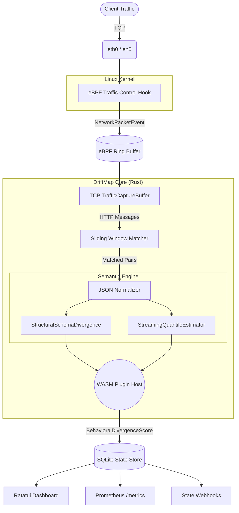

<p align="center">
  <h1 align="center">🗺️ DriftMap</h1>
  <p align="center">
    <strong>Runtime Semantic Diff for Live Systems</strong>
    <br/>
    <em>Powered by eBPF, Rust, and WebAssembly</em>
  </p>
</p>

<p align="center">
  
  
  
  
  
</p>

## 📖 Overview

**DriftMap** is an enterprise-grade observability platform that watches two live environments (e.g., Staging vs. Production, or V1 vs. V2 of a microservice) simultaneously and surfaces **behavioral divergence** in real-time. 

Unlike traditional tools that diff static configurations or logs, DriftMap uses kernel-level eBPF to capture live network traffic with near-zero overhead. It semantically compares the responses of two systems to the exact same requests, ignoring non-deterministic fields (like timestamps or UUIDs) to highlight true architectural regressions.

---

## 📦 Installation

DriftMap provides pre-compiled binaries for Linux (x86_64 and aarch64).

### 1. One-Line Installer (Recommended)
The easiest way to install the latest pre-compiled binary is using our installation script:

```bash
curl -sSL https://raw.githubusercontent.com/adharshitt/Driftmap/main/install.sh | bash
```
*This script automatically detects your architecture (x86_64 or aarch64), downloads the latest binary from GitHub Releases, and installs it to `/usr/local/bin/driftmap`.*

### 2. Install via Cargo
```bash
cargo install --git https://github.com/adharshitt/Driftmap.git driftmap-cli
```

### 3. Using Docker
```bash
docker pull ghcr.io/adharshitt/driftmap:latest
docker run --cap-add=NET_ADMIN --cap-add=SYS_ADMIN --network=host driftmap:latest watch --target-a 10.0.0.1:80 --target-b 10.0.0.2:80
```

---

## 🚀 Getting Started

The easiest way to get started with DriftMap is to use the interactive initialization wizard, which will safely provision your configuration file.

### 1. Initialize Configuration
Run the built-in wizard to configure your network interface and target environments:
```bash
driftmap init
```
*This will create a `driftmap.toml` file in your current directory.*

### 2. Start Watching (eBPF Mode)
Attach the eBPF probe and launch the real-time TUI dashboard. This requires `sudo` or `CAP_NET_ADMIN` capabilities to attach to the kernel:
```bash
sudo driftmap watch --config driftmap.toml
```

### 3. Start Watching (Proxy Mirror Mode)
If you cannot run eBPF in your environment, DriftMap includes a transparent TCP proxy mode. It duplicates incoming traffic and forwards it to both targets without requiring root:
```bash
driftmap proxy --listen 0.0.0.0:8080 --target-a 127.0.0.1:3000 --target-b 127.0.0.1:3001
```

### 4. Analyze Divergence
When DriftMap detects a behavioral drift, you can replay a unified colored diff of the most recent divergent responses, formatted just like `git diff`:
```bash
driftmap diff "POST /api/orders" --last 5
```

---

## 🛠️ CLI Reference

You can always invoke the built-in help command to see available options:

```bash
$ driftmap help
Runtime semantic diff for live systems

Usage: driftmap <COMMAND>

Commands:
  watch    Watch two live services and surface behavioral drift
  diff     Show recent diverging response pairs for an endpoint
  proxy    Start the TCP Mirror Proxy mode
  init     Interactive initialization wizard to create config
  help     Print this message or the help of the given subcommand(s)

Options:
  -h, --help     Print help
  -V, --version  Print version
```

---

## 📊 Real-Time Terminal Dashboard

DriftMap features a highly optimized, `ratatui`-powered Terminal UI to monitor semantic drift in real-time without leaving your SSH session.

```text
┌ Endpoints (s:Score n:Name r:Requests) ──────────────┐ ┌ Details ──────────────────────────────────────┐
│ ✓    0.0%  GET /api/health                          │ │ Endpoint: GET /api/users/:id                  │
│ ⚠   12.4%  GET /api/users/:id                       │ │ Behavioral Divergence Score: 12.4%            │
│ ✗   85.2%  POST /api/orders                         │ │ Total Sample Count: 14,230                    │
│ ✓    1.2%  GET /api/products                        │ │                                               │
│ ✓    0.5%  PUT /api/settings                        │ │ Diagnostic Breakdown:                         │
│                                                     │ │ - Protocol Status:   0.0%  (100% Match)       │
│                                                     │ │ - Structural Schema: 45.0% (Missing 'discount')│
│                                                     │ │ - Latency Profile:   4.2%  (p95 Δ: +12ms)     │
│                                                     │ │ - Header Signatures: 0.0%  (Ignored dynamic)  │
└─────────────────────────────────────────────────────┘ └───────────────────────────────────────────────┘
```

---

## 🏗️ Architecture & Data Flow

DriftMap is designed for high-throughput, low-latency packet processing.



---

## ✨ Enterprise Features

*   **Near-Zero Overhead Capture:** Uses eBPF Traffic Control (TC) hooks to duplicate raw packet data straight from the kernel. No sidecar proxies required.
*   **Semantic Equivalence Engine:**
    *   **Schema Inference:** Recursively analyzes JSON structures to detect added, removed, or type-shifted fields.
    *   **Statistical Divergence:** Uses constant-memory `t-Digest` algorithms to track p50, p95, and p99 latency and numeric value distributions.
    *   **Smart Normalization:** Automatically strips timestamps, UUIDs, and configurable non-deterministic fields.
*   **WASM Extensibility:** Write custom protocol scorers (e.g., gRPC, GraphQL) in any language that compiles to WebAssembly and load them at runtime safely via Wasmtime.
*   **Enterprise Operations:**
    *   **Zero-Downtime Hot-Reload:** Watches `driftmap.toml` via `notify` for live configuration updates without dropping packets or resetting the eBPF maps.
    *   **Telemetry Integration:** Exposes a Prometheus `/metrics` endpoint and fires JSON Webhooks for state transitions (e.g., `EQUIVALENT` → `DIVERGED`).
    *   **Local Persistence:** SQLite WAL-mode datastore for historical replay and offline unified-color diffing.

---

<p align="center">
  <em>Built with precision for top-tier infrastructure teams.</em>
</p>
